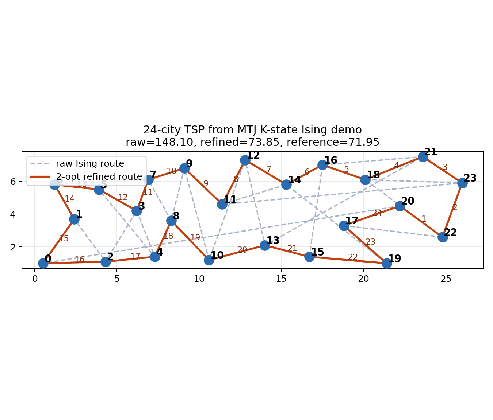
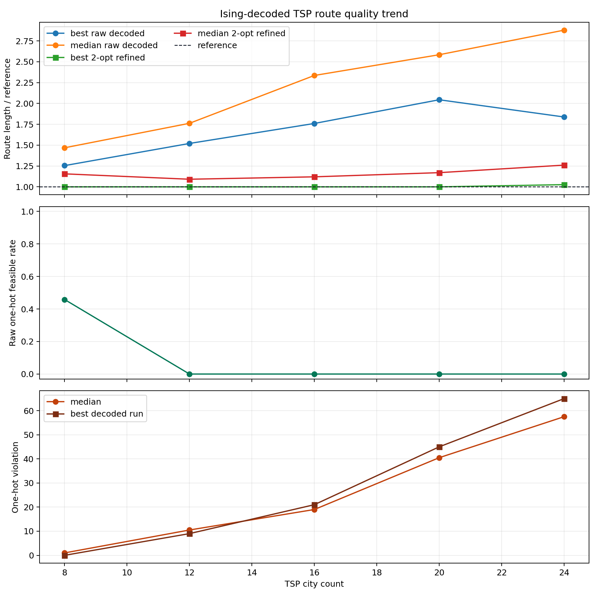
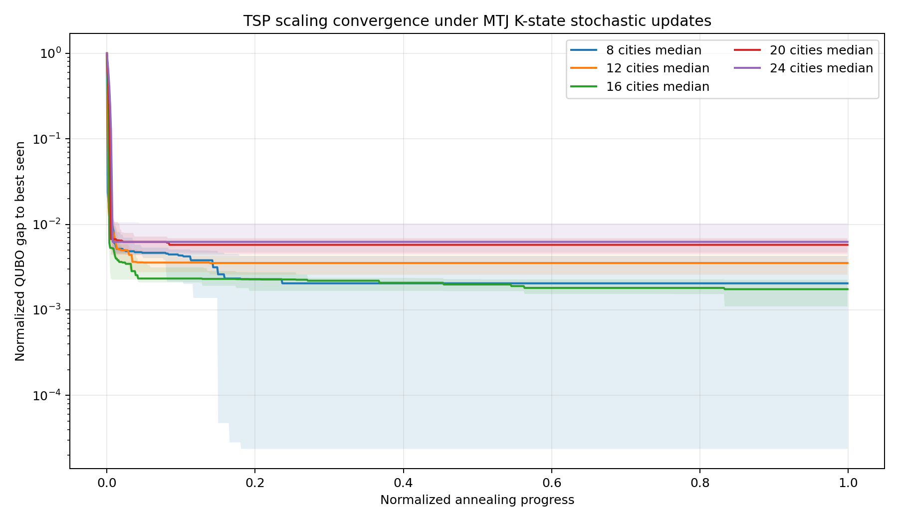
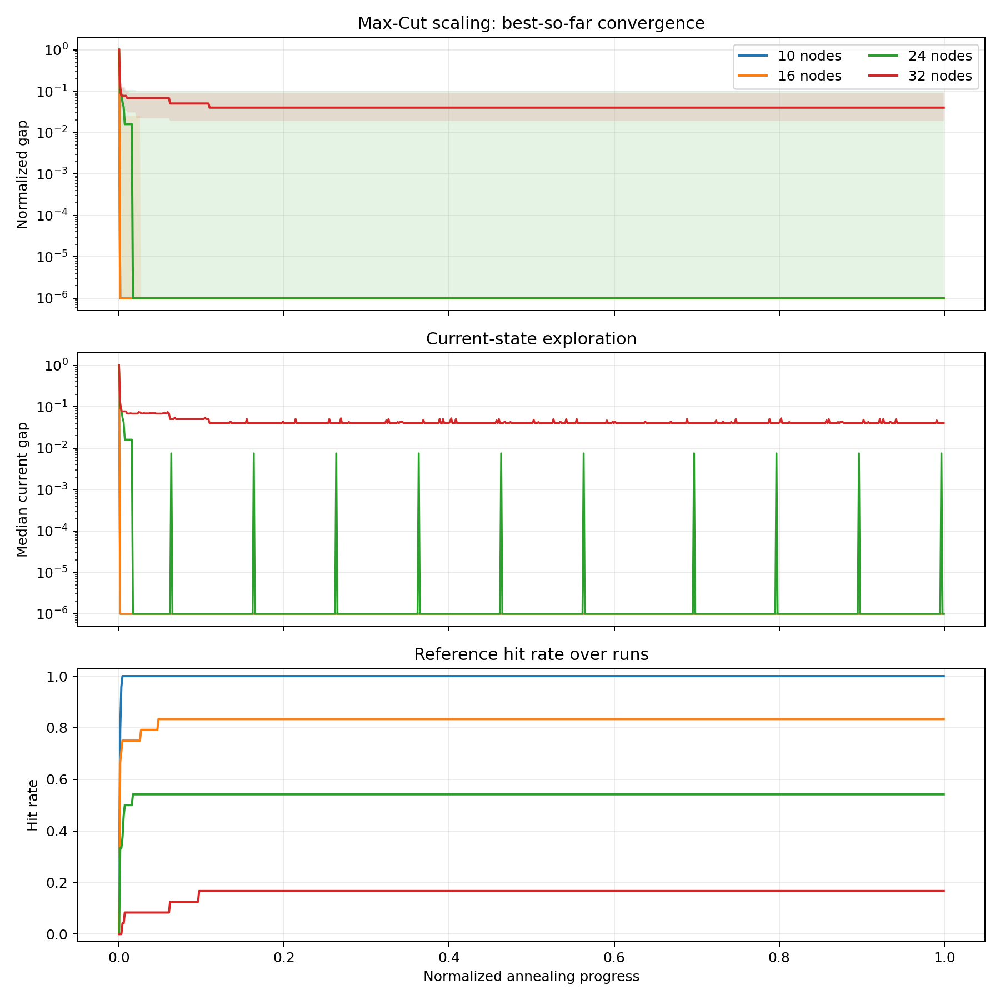
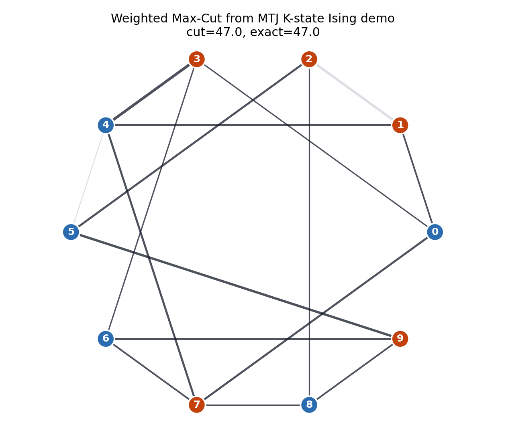
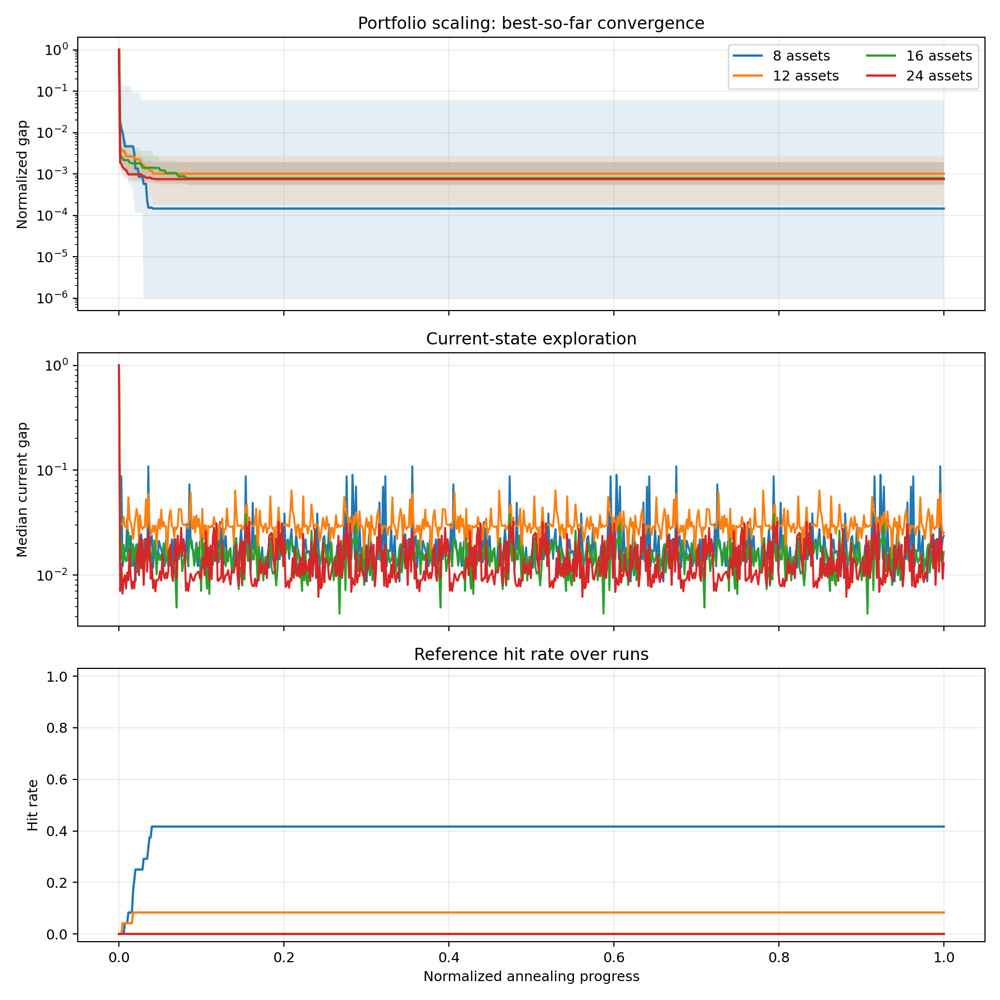
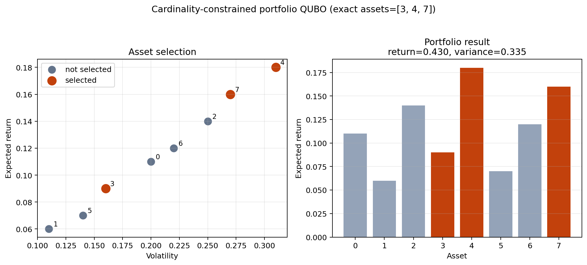

# MTJ K-State Ising Machine Application Demos

本文总结当前基于 MTJ physical K-state stochastic model 的 Ising machine 应用 demo。核心思路是：先将实际组合优化问题写成 QUBO，再转换为 Ising 能量函数，最后用从 MTJ 实验数据拟合出的 K-state 隐状态、dwell rate、transition behavior 和随机序列来驱动随机更新。

相关脚本与输出：

- 主脚本：`mtj_ising_application_demos.py`
- 总结文件：`mtj_ising_application_demos_output/application_demo_summary.json`
- TSP scaling：`mtj_ising_application_demos_output/tsp_scaling_summary.csv`
- Max-Cut scaling：`mtj_ising_application_demos_output/maxcut_scaling_summary.csv`
- Portfolio scaling：`mtj_ising_application_demos_output/portfolio_scaling_summary.csv`

## 1. Physical K-State Ising Solver

当前模型先从 measured MTJ time-series 中提取多状态 stochastic profile。对 good dataset 的结果为：

| quantity | value |
|---|---:|
| selected K | 4 |
| p-bit dimensions | 2 |
| state entropy | 1.665 bits |

该 K-state profile 提供三个核心硬件随机资源：

1. 离散隐状态序列：`step_states`
2. 每个状态的 dwell/exit rate：`exit_rates`
3. 由 MTJ 信号重采样得到的随机数矩阵：`random_u`

优化问题统一写为 Ising energy：

$$
E(s) = -\frac{1}{2}s^T J s - h^T s + C,\qquad s_i \in \{-1,+1\}.
$$

每次更新一个 spin，局部场为：

$$
H_i = \sum_j J_{ij}s_j + h_i.
$$

翻转第 \(i\) 个 spin 的能量变化为：

$$
\Delta E_i = 2s_i H_i.
$$

MTJ K-state solver 中，proposal probability 由硬件状态 bias 和 Ising 局部场共同决定：

$$
p(s_i^{\mathrm{new}}=+1)
=
\sigma\left[
2\left(
g_{\mathrm{data}} b_k
+
g_{\mathrm{coupling}}\frac{H_i}{E_{\mathrm{scale}}}
\right)
\right],
$$

其中

$$
\sigma(x)=\frac{1}{1+e^{-x}}.
$$

若 proposed spin 会降低能量，则直接接受；若升高能量，则使用由 MTJ dwell/exit rate 控制的 hazard acceptance：

$$
p_{\mathrm{accept}}
=
1-\exp\left[
-\gamma r_k \Delta t
\exp\left(-\frac{\Delta E}{E_{\mathrm{scale}}}\right)
\right].
$$

这里 \(r_k\) 是当前 K-state 的 exit rate，\(\Delta t\) 来自 MTJ profile 的时间步长，\(\gamma\) 是 hazard gain。

## 2. QUBO to Ising Mapping

所有实际问题先写成 QUBO：

$$
Q(x)=C+\sum_i a_i x_i+\sum_{i<j} b_{ij}x_i x_j,\qquad x_i\in\{0,1\}.
$$

二进制变量和 Ising spin 的关系为：

$$
x_i=\frac{s_i+1}{2}.
$$

代入后可得：

$$
Q(x(s)) = -\frac{1}{2}s^TJs-h^Ts+C'.
$$

因此同一个 MTJ K-state Ising solver 可以统一处理 TSP、Max-Cut、Portfolio 等不同问题。

## 3. Demo 1: Traveling Salesman Problem

### 3.1 Problem Meaning

TSP 表示路线规划问题：给定 \(N\) 个城市和两两距离，寻找一条经过每个城市一次并回到起点的最短闭合路径。它可代表：

- 物流配送路径规划
- 芯片布线/探针测试路径优化
- 机器人巡检路径规划
- 任务访问顺序优化

### 3.2 QUBO Formulation

定义变量：

$$
x_{i,t} =
\begin{cases}
1,& \text{city } i \text{ is visited at position } t,\\
0,& \text{otherwise}.
\end{cases}
$$

每个位置只能有一个城市：

$$
\sum_i x_{i,t}=1,\qquad \forall t.
$$

每个城市只能出现一次：

$$
\sum_t x_{i,t}=1,\qquad \forall i.
$$

路径长度目标为：

$$
L(x)=
\sum_{t=0}^{N-1}\sum_{i,j} d_{ij}x_{i,t}x_{j,t+1},
$$

其中 \(t+1\) 使用周期边界，即最后一个位置回到第一个位置。

完整 QUBO 为：

$$
Q_{\mathrm{TSP}}(x)
=
L(x)
+
A\sum_t\left(\sum_i x_{i,t}-1\right)^2
+
A\sum_i\left(\sum_t x_{i,t}-1\right)^2.
$$

为了去掉旋转等价性，demo 中固定 city 0 在 position 0：

$$
A(x_{0,0}-1)^2.
$$

### 3.3 Results

TSP 从 8 城市一直扩展到 24 城市。变量数随城市数平方增长：

$$
n_{\mathrm{var}}=N^2.
$$

| cities | Ising variables | reference length | best raw / ref | median raw / ref | best 2-opt / ref | median 2-opt / ref | feasible rate | median one-hot violation |
|---:|---:|---:|---:|---:|---:|---:|---:|---:|
| 8 | 64 | 23.346 | 1.255 | 1.468 | 1.000 | 1.156 | 0.458 | 1.0 |
| 12 | 144 | 34.645 | 1.520 | 1.762 | 1.000 | 1.091 | 0.000 | 10.5 |
| 16 | 256 | 48.033 | 1.760 | 2.335 | 1.000 | 1.120 | 0.000 | 19.0 |
| 20 | 400 | 59.948 | 2.044 | 2.584 | 1.000 | 1.170 | 0.000 | 40.5 |
| 24 | 576 | 71.952 | 1.838 | 2.878 | 1.026 | 1.260 | 0.000 | 57.5 |

For 8 cities, the reference is exact optimum. For 12/16/20/24 cities, the reference is generated by nearest-neighbor all-start plus 2-opt.

主要观察：

- TSP 的 QUBO encoding 随规模快速变硬，因为 one-hot constraints 数量和变量数都按 \(N^2\) 增长。
- Raw Ising decoded route 的质量随城市数增加明显下降。
- Raw one-hot feasible rate 在 12 城市之后降为 0，说明单 bit flip dynamics 很难直接满足 TSP 的 permutation matrix constraint。
- 但是 raw Ising state 仍能作为 route seed。经过 2-opt repair 后，8/12/16/20 城市均达到 reference；24 城市达到 reference 的 \(1.026\times\)。

对应图：

## 4. Demo 2: Weighted Max-Cut

### 4.1 Problem Meaning

Max-Cut 是图划分问题：给定带权图 \(G=(V,E)\)，将节点分成两组，使跨越两组的边权重总和最大。它可代表：

- 社区划分
- 网络分割
- VLSI partitioning
- 图聚类
- 资源冲突图的二分优化

### 4.2 QUBO / Ising Formulation

令：

$$
x_i =
\begin{cases}
0,& \text{node } i \text{ in partition A},\\
1,& \text{node } i \text{ in partition B}.
\end{cases}
$$

边 \((i,j)\) 被 cut 当且仅当 \(x_i \ne x_j\)。对二进制变量，有：

$$
\mathrm{cut}_{ij}=x_i+x_j-2x_ix_j.
$$

最大化 cut weight：

$$
\max_x \sum_{(i,j)\in E} w_{ij}(x_i+x_j-2x_ix_j).
$$

转换成 QUBO minimization：

$$
Q_{\mathrm{MaxCut}}(x)
=
-\sum_{(i,j)\in E} w_{ij}(x_i+x_j-2x_ix_j).
$$

Max-Cut 没有 one-hot 约束，因此比 TSP 更适合直接由 Ising dynamics 表示。

### 4.3 Results

| nodes | variables | edges | reference cut | reference method | best cut ratio | median cut ratio | hit rate |
|---:|---:|---:|---:|---|---:|---:|---:|
| 10 | 10 | 16 | 47 | exact | 1.000 | 1.000 | 1.000 |
| 16 | 16 | 53 | 154 | exact | 1.000 | 1.000 | 0.833 |
| 24 | 24 | 108 | 313 | multi-start 1-flip local search | 1.000 | 1.000 | 0.542 |
| 32 | 32 | 130 | 380 | multi-start 1-flip local search | 1.000 | 0.987 | 0.167 |

主要观察：

- Max-Cut 的变量数只随节点数线性增长：

$$
n_{\mathrm{var}}=|V|.
$$

- 没有 hard one-hot constraint，因此 raw Ising state 本身就是合法 partition。
- 在 10/16/24 nodes 上，median result 已接近或达到 reference。
- 32 nodes 时 hit rate 降到 0.167，说明规模增加后 stochastic search 的成功率开始下降，但 best run 仍能达到 reference。
- `current-state exploration` 曲线显示优化器不是静态停住，而是在较优区域附近继续跳动。

对应图：

## 5. Demo 3: Cardinality-Constrained Portfolio Selection

### 5.1 Problem Meaning

Portfolio selection 是投资组合选择问题：给定资产收益和风险，选择固定数量的资产，使收益高、风险低。它可代表：

- 金融投资组合优化
- 多候选设计方案选择
- 传感器/特征选择
- 固定预算下的资源配置

### 5.2 QUBO Formulation

令：

$$
x_i =
\begin{cases}
1,& \text{asset } i \text{ is selected},\\
0,& \text{otherwise}.
\end{cases}
$$

收益为：

$$
R(x)=\mu^Tx.
$$

风险用 covariance matrix 表示：

$$
\mathrm{Risk}(x)=x^T\Sigma x.
$$

选择固定数量 \(K\) 个资产：

$$
\sum_i x_i = K.
$$

QUBO minimization 写为：

$$
Q_{\mathrm{Portfolio}}(x)
=
\lambda_{\mathrm{risk}}x^T\Sigma x
-
\lambda_{\mathrm{return}}\mu^T x
+
A\left(\sum_i x_i-K\right)^2.
$$

其中 \(\lambda_{\mathrm{risk}}\) 控制风险权重，\(\lambda_{\mathrm{return}}\) 控制收益权重，\(A\) 是 cardinality penalty。

### 5.3 Results

| assets | variables | choose K | reference objective | best gap | median gap | hit rate | feasible rate |
|---:|---:|---:|---:|---:|---:|---:|---:|
| 8 | 8 | 3 | -0.506 | 0.000 | 0.004 | 0.417 | 1.000 |
| 12 | 12 | 3 | -0.906 | 0.000 | 0.062 | 0.083 | 1.000 |
| 16 | 16 | 4 | -0.983 | 0.025 | 0.104 | 0.000 | 1.000 |
| 24 | 24 | 6 | -1.840 | 0.157 | 0.278 | 0.000 | 1.000 |

主要观察：

- Portfolio 的变量数随资产数线性增长：

$$
n_{\mathrm{var}}=N_{\mathrm{assets}}.
$$

- Cardinality constraint 比 TSP 的 permutation constraint 简单，因此 feasible rate 始终为 1.0。
- 随资产数增加，达到 exact reference 的 hit rate 下降：8 assets 为 0.417，12 assets 为 0.083，16/24 assets 为 0。
- 虽然 16/24 assets 没有命中 exact reference，但 best gap 仍有限，说明 MTJ K-state solver 能找到接近最优的组合。
- `current-state exploration` 曲线显示当前状态在低 gap 区域持续波动，说明系统仍保持随机探索能力。

对应图：

## 6. Cross-Problem Comparison

三个问题展示了 Ising machine 在不同结构上的行为差异。

| problem | variables growth | constraint type | raw Ising state validity | main bottleneck |
|---|---|---|---|---|
| TSP | \(N^2\) | permutation / one-hot | often invalid for large N | hard one-hot constraints |
| Max-Cut | \(|V|\) | unconstrained binary partition | always valid | larger graph search space |
| Portfolio | \(N\) | cardinality | valid in current runs | objective landscape and exact hit rate |

从结果看：

1. Max-Cut 最自然地适配 Ising machine，因为问题本身就是二值 spin partition。
2. Portfolio 也适合 QUBO/Ising，但固定 cardinality penalty 会影响大规模 exact hit rate。
3. TSP 最难，因为它需要 permutation matrix。直接 Ising dynamics 很难维持 one-hot constraints，因此需要 decoding/repair，例如 2-opt。

## 7. Interpretation of Convergence Figures

当前 convergence figures 的结构如下：

- solid line：多次 runs 的 median trajectory
- translucent band：25%-75% quantile interval
- best-so-far convergence：历史最优能量随 annealing progress 的下降
- current-state exploration：当前状态能量的中位数，用于观察系统是否仍在探索
- hit rate：截至当前 progress，有多少 runs 达到 reference solution

对于 TSP，convergence 图显示的是不同 city count 的 normalized QUBO gap：

$$
g(t)=\frac{E_{\mathrm{best}}(t)-E_{\mathrm{best,all}}}
{E_{\mathrm{best}}(0)-E_{\mathrm{best,all}}}.
$$

对于 Max-Cut 和 Portfolio，structured convergence 使用 reference objective：

$$
g(t)=\frac{E_{\mathrm{best}}(t)-E_{\mathrm{ref}}}
{E_{\mathrm{best}}(0)-E_{\mathrm{ref}}}.
$$

Hit rate 定义为：

$$
\mathrm{HitRate}(t)
=
\frac{1}{M}\sum_{m=1}^M
\mathbf{1}\left[
E_{\mathrm{best}}^{(m)}(t)-E_{\mathrm{ref}}\le \epsilon
\right].
$$

## 8. Main Conclusions

1. The MTJ physical K-state model can be used as a hardware-derived stochastic driver for Ising/QUBO optimization.
2. Problem structure strongly determines performance. Unconstrained binary problems such as Max-Cut are most compatible with direct Ising dynamics.
3. TSP exposes the limitation of direct single-spin updates under strong one-hot constraints. The raw Ising state becomes infeasible as problem size increases, but still contains route information useful for local repair.
4. Portfolio shows that cardinality-constrained selection remains feasible, but exact hit rate decreases with asset count.
5. The most practical pipeline is not pure Ising decoding alone, but:

$$
\text{problem}
\rightarrow
\text{QUBO}
\rightarrow
\text{Ising solver}
\rightarrow
\text{domain-specific decoding/repair}.
$$

For TSP, the repair is 2-opt. For Max-Cut, no repair is needed. For Portfolio, the penalty formulation already produced feasible cardinality in these runs.

